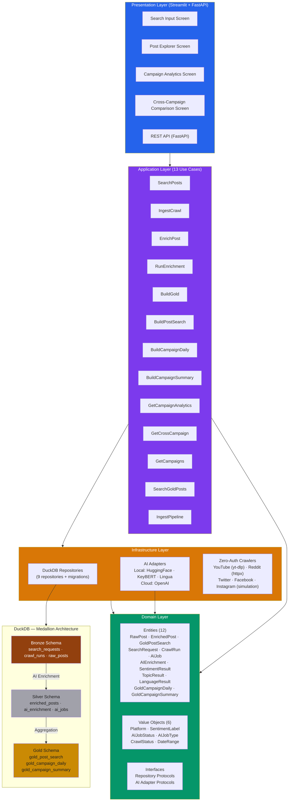

# SocialPulse — Social Media Intelligence Platform

A production-grade, open-source social media analytics platform that crawls, enriches with AI, and visualizes social media conversations across **5 platforms** (Twitter, Facebook, Instagram, YouTube, Reddit). Built with a **medallion architecture** (Bronze → Silver → Gold) on **DuckDB** for zero-dependency, columnar OLAP analytics.

## Architecture



### Medallion Data Architecture

| Layer | Purpose | Tables | Key Transformations |
|-------|---------|--------|-------------------|
| **Bronze** | Raw ingested data | `search_requests`, `crawl_runs`, `raw_posts` | Crawl → Store as-is |
| **Silver** | AI-enriched data | `enriched_posts`, `ai_enrichment`, `ai_jobs` | Sentiment analysis, topic extraction, language detection |
| **Gold** | Analytics-ready | `gold_post_search`, `gold_campaign_daily`, `gold_campaign_summary` | Denormalized joins, daily aggregations, campaign summaries |

### Supported Platforms

| Platform | Method | Auth Required |
|----------|--------|---------------|
| **YouTube** | yt-dlp (two-phase: search → per-video extract) | No |
| **Reddit** | httpx (JSON API, old.reddit.com) | No |
| **Twitter** | Simulation (requires Bearer token for real data) | Yes |
| **Facebook** | Simulation | No |
| **Instagram** | Simulation | No |

## Tech Stack

| Component | Technology | Rationale |
|-----------|-----------|-----------|
| Database | DuckDB | Columnar OLAP, zero-config, embedded, portable |
| Backend | Python 3.12 | Type-safe, rich ML ecosystem |
| Domain | Pydantic v2 | Strict validation, frozen entities, JSON schema |
| AI/NLP (local) | HuggingFace Transformers, KeyBERT, Lingua | Local inference, zero cost |
| AI/NLP (cloud) | OpenAI API | LLM-based sentiment, topic, language analysis |
| Crawling | yt-dlp, httpx | Zero-auth YouTube and Reddit scraping |
| Frontend | Streamlit | Python-native, rapid prototyping |
| API | FastAPI + uvicorn | REST API with SSE streaming |
| Charts | Plotly | Interactive, Streamlit-native |
| Logging | structlog | Structured JSON logging |
| Testing | pytest, Playwright | Unit + integration + E2E |
| Quality | Ruff, mypy, pyright | Linting, formatting, type checking |
| Packaging | uv + hatchling | Fast installs, reproducible builds |
| Deployment | Docker multi-stage | 8 targets: base, test, lint, runtime, api, worker, crawl-worker, gold-builder |
| Transformation | dbt-duckdb | SQL-based medallion layer transforms |

## Quick Start

### Prerequisites

- Python 3.12+
- [uv](https://docs.astral.sh/uv/) package manager
- Docker (optional, for containerized deployment)

### Install

```bash
# Clone
git clone git@github.com:sulthonzh/social-pulse.git
cd social-pulse

# Install dependencies
uv sync --all-extras --dev

# Install Playwright browsers (for E2E tests)
uv run playwright install chromium
```

### Run Tests

```bash
# Full test suite
uv run pytest tests/ -v

# Unit tests only
uv run pytest tests/ -v -m unit

# Integration tests only
uv run pytest tests/ -v -m integration

# E2E tests only
uv run pytest tests/ -v -m e2e

# With coverage
uv run pytest tests/ -v --cov=src --cov-report=html
```

### Run the App

```bash
# Streamlit app
uv run streamlit run src/presentation/app.py --server.port=8501

# FastAPI server
uv run uvicorn src.presentation.api:app --port=8000
```

Open http://localhost:8501 (Streamlit) or http://localhost:8000 (API)

### Docker

```bash
# Build
docker-compose -f docker/docker-compose.yml build

# Run app + API
docker-compose -f docker/docker-compose.yml up app api

# Run full pipeline (crawlers, AI worker, gold builder, dbt)
docker-compose -f docker/docker-compose.yml --profile pipeline up

# Run dbt docs on port 8585
docker-compose -f docker/docker-compose.yml --profile dbt-docs up dbt-docs

# Run tests
docker-compose -f docker/docker-compose.yml --profile ci run --rm test

# Run linting
docker-compose -f docker/docker-compose.yml --profile ci run --rm lint
```

## Project Structure

```
src/
├── domain/                          # Domain layer (pure Python, no deps)
│   ├── entities/                    # 12 domain entities
│   ├── value_objects/               # 6 value objects
│   ├── exceptions.py                # Error hierarchy
│   └── interfaces.py                # Repository + adapter protocols
├── application/                     # Application layer (use cases)
│   └── use_cases/                   # 13 use cases
├── infrastructure/                  # Infrastructure layer
│   ├── persistence/                 # 9 DuckDB repositories + migrations
│   ├── ai/                          # AI adapters (local HuggingFace + OpenAI)
│   └── crawling/                    # Zero-auth crawlers (YouTube, Reddit, simulation)
├── presentation/                    # Presentation layer
│   ├── app.py                       # Streamlit entry point
│   ├── api.py                       # FastAPI entry point
│   ├── screens/                     # 4 screens
│   └── components/                  # Charts + filters
└── shared/                          # Config, utilities

tests/
├── unit/                            # 44 unit tests (domain, infrastructure, application)
├── integration/                     # 4 pipeline integration tests
└── e2e/                             # 5 Playwright E2E tests

scripts/
└── transformations/                 # SQL transforms (bronze → silver)

docker/
├── Dockerfile                       # Multi-stage build (8 targets)
└── docker-compose.yml               # 9 services with profiles

dbt/                                 # dbt-duckdb models
```

## Test Coverage

- **53 test files** across unit (44), integration (4), and E2E (5)
- **100% code coverage** on all source modules
- **pytest markers**: `unit`, `integration`, `e2e`, `slow`, `requires_api`

## Screens

### 1. Search Input
Create search requests to crawl social media posts across 5 platforms (Twitter, Facebook, Instagram, YouTube, Reddit). Enter a keyword, select platform, set date range, and submit.

### 2. Post Explorer
Browse AI-enriched posts with filters for keyword, sentiment, platform, and date range. Each post shows author, sentiment score, engagement metrics, and detected topics. Real crawled data from YouTube and Reddit with full `posted_at` and `post_text` support.

### 3. Campaign Analytics
Select a campaign to view KPIs (total posts, sentiment breakdown, avg confidence), sentiment distribution chart, volume trends, top hashtags, and engagement metrics.

### 4. Cross-Campaign Comparison
Select 2+ campaigns to compare side-by-side with sentiment, volume, and engagement comparison charts plus a summary table.

## Configuration

Environment variables (prefix: `SOCIALPULSE_`):

| Variable | Default | Description |
|----------|---------|-------------|
| `SOCIALPULSE_DB_PATH` | `data/socialpulse.duckdb` | DuckDB database path |
| `SOCIALPULSE_LOG_LEVEL` | `INFO` | Logging level |
| `SOCIALPULSE_AI_PROVIDER` | `local` | AI provider: `local` (HuggingFace) or `openai` |
| `SOCIALPULSE_SENTIMENT_MODEL` | `cardiffnlp/twitter-roberta-base-sentiment-latest` | HuggingFace sentiment model |
| `SOCIALPULSE_TOPIC_MODEL` | `all-MiniLM-L6-v2` | Sentence transformer for topic extraction |
| `SOCIALPULSE_HF_MODEL_CACHE_DIR` | `.cache/huggingface` | HuggingFace model cache directory |
| `SOCIALPULSE_OPENAI_API_KEY` | `""` | OpenAI API key (required when `AI_PROVIDER=openai`) |
| `SOCIALPULSE_OPENAI_BASE_URL` | `https://api.z.ai/api/coding/paas/v4` | OpenAI-compatible API base URL |
| `SOCIALPULSE_OPENAI_MODEL` | `glm-4.7` | OpenAI model name |
| `SOCIALPULSE_MAX_CRAWL_RESULTS` | `1000` | Max posts per crawl |
| `SOCIALPULSE_CRAWL_TIMEOUT_SECONDS` | `30` | HTTP request timeout for crawlers |
| `SOCIALPULSE_AI_MAX_RETRIES` | `3` | Max retries for AI enrichment operations |
| `SOCIALPULSE_GOLD_REBUILD_BATCH_SIZE` | `10000` | Batch size for gold table rebuilds |
| `SOCIALPULSE_TWITTER_BEARER_TOKEN` | `""` | Twitter API bearer token |
| `SOCIALPULSE_TWITTER_API_KEY` | `""` | Twitter API key |
| `SOCIALPULSE_TWITTER_API_SECRET` | `""` | Twitter API secret |

## Docker Services

| Service | Port | Profile | Description |
|---------|------|---------|-------------|
| `app` | 8501 | default | Streamlit web application |
| `api` | 8000 | default | FastAPI REST server |
| `worker` | — | `pipeline` | Background AI enrichment worker |
| `crawl-worker` | — | `pipeline` | Social media crawl worker |
| `gold-builder` | — | `pipeline` | Gold table aggregation builder |
| `dbt` | — | `pipeline` | dbt-duckdb data transformation |
| `dbt-docs` | 8585 | `dbt-docs` | dbt documentation server |
| `test` | — | `ci` | Test runner |
| `lint` | — | `ci` | Linting and type checking |

## License

MIT
