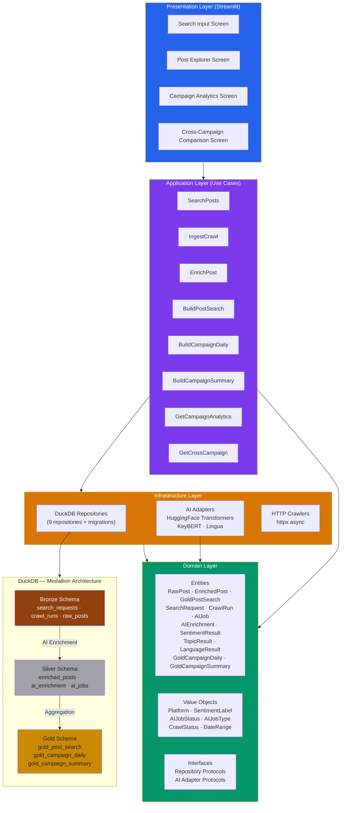

# SocialPulse — Social Media Intelligence Platform

A production-grade, open-source social media analytics platform that crawls, enriches with AI, and visualizes social media conversations. Built with a **medallion architecture** (Bronze → Silver → Gold) on **DuckDB** for zero-dependency, columnar OLAP analytics.

## Architecture



### Medallion Data Architecture

| Layer | Purpose | Tables | Key Transformations |
|-------|---------|--------|-------------------|
| **Bronze** | Raw ingested data | `search_requests`, `crawl_runs`, `raw_posts` | Crawl → Store as-is |
| **Silver** | AI-enriched data | `enriched_posts`, `ai_enrichment`, `ai_jobs` | Sentiment analysis, topic extraction, language detection |
| **Gold** | Analytics-ready | `gold_post_search`, `gold_campaign_daily`, `gold_campaign_summary` | Denormalized joins, daily aggregations, campaign summaries |

## Tech Stack

| Component | Technology | Rationale |
|-----------|-----------|-----------|
| Database | DuckDB | Columnar OLAP, zero-config, embedded, portable |
| Backend | Python 3.12 | Type-safe, rich ML ecosystem |
| Domain | Pydantic v2 | Strict validation, frozen entities, JSON schema |
| AI/NLP | HuggingFace Transformers, KeyBERT, Lingua | Local inference, zero cost |
| Frontend | Streamlit | Python-native, rapid prototyping |
| Charts | Altair | Declarative, Streamlit-native |
| Testing | pytest, Playwright | Unit + integration + E2E |
| Quality | Ruff, mypy, pyright | Linting, formatting, type checking |
| Packaging | uv + hatchling | Fast installs, reproducible builds |
| Deployment | Docker multi-stage | Separate targets for test/lint/app/worker/gold-builder |

## Quick Start

### Prerequisites

- Python 3.12+
- [uv](https://docs.astral.sh/uv/) package manager
- DuckDB (installed via pip)

### Install

```bash
# Clone
git clone git@github.com:sulthonzh/social-pulse.git
cd social-pulse

# Install dependencies
uv sync --all-extras --dev

# Install Playwright browsers (for E2E tests)
uv run playwright install chromium
```

### Run Tests

```bash
# Full test suite
uv run pytest tests/ -v

# Unit tests only
uv run pytest tests/ -v -m unit

# Integration tests only
uv run pytest tests/ -v -m integration

# E2E tests only
uv run pytest tests/ -v -m e2e

# With coverage
uv run pytest tests/ -v --cov=src --cov-report=html
```

### Run the App

```bash
uv run streamlit run src/presentation/app.py --server.port=8501
```

Open http://localhost:8501

### Docker

```bash
# Build
docker compose -f docker/docker-compose.yml build

# Run tests
docker compose -f docker/docker-compose.yml --profile ci run --rm test

# Run app
docker compose -f docker/docker-compose.yml up app
```

## Project Structure

```
src/
├── domain/                          # Domain layer (pure Python, no deps)
│   ├── entities/                    # 13 domain entities
│   ├── value_objects/               # 6 value objects
│   ├── exceptions.py                # Error hierarchy
│   └── interfaces.py                # Repository + adapter protocols
├── application/                     # Application layer (use cases)
│   └── use_cases/                   # 9 use cases
├── infrastructure/                  # Infrastructure layer
│   ├── persistence/                 # 9 DuckDB repositories + migrations
│   ├── ai/                          # 3 AI adapters (sentiment, topic, language)
│   └── crawling/                    # HTTP crawlers
├── presentation/                    # Presentation layer (Streamlit)
│   ├── app.py                       # Entry point
│   ├── screens/                     # 4 screens
│   └── components/                  # Charts + filters
└── shared/                          # Config, utilities

tests/
├── unit/                            # Unit tests (domain, infrastructure, application)
├── integration/                     # Pipeline integration tests
└── e2e/                             # Playwright E2E tests
```

## Test Coverage

- **461 tests passing** across unit, integration, and E2E (+ 17 E2E Playwright tests)
- **100% code coverage** on all source modules
- **pytest markers**: `unit`, `integration`, `e2e`, `slow`, `requires_api`

## Screens

### 1. Search Input
Create search requests to crawl social media posts. Enter a keyword, select platform, set date range, and submit.

### 2. Post Explorer
Browse AI-enriched posts with filters for keyword, sentiment, platform, and date range. Each post shows author, sentiment score, engagement metrics, and detected topics.

### 3. Campaign Analytics
Select a campaign to view KPIs (total posts, sentiment breakdown, avg confidence), sentiment distribution chart, volume trends, top hashtags, and engagement metrics.

### 4. Cross-Campaign Comparison
Select 2+ campaigns to compare side-by-side with sentiment, volume, and engagement comparison charts plus a summary table.

## Configuration

Environment variables (prefix: `SOCIALPULSE_`):

| Variable | Default | Description |
|----------|---------|-------------|
| `SOCIALPULSE_DB_PATH` | `data/socialpulse.duckdb` | DuckDB database path |
| `SOCIALPULSE_LOG_LEVEL` | `INFO` | Logging level |
| `SOCIALPULSE_SENTIMENT_MODEL` | `cardiffnlp/twitter-roberta-base-sentiment-latest` | HuggingFace sentiment model |
| `SOCIALPULSE_TOPIC_MODEL` | `all-MiniLM-L6-v2` | Sentence transformer for topic extraction |
| `SOCIALPULSE_MAX_CRAWL_RESULTS` | `1000` | Max posts per crawl |

## License

MIT
